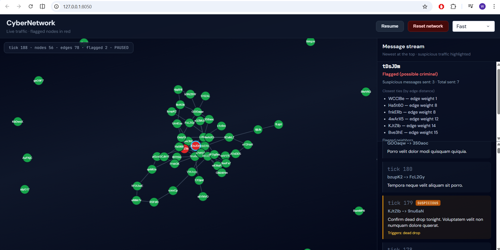

# CyberNetwork

A small Python project that simulates a growing computer network: nodes and links appear over time, nodes exchange encrypted traffic, and a simple surveillance layer flags criminal senders who repeatedly use suspicious trigger phrases. The interactive Dash UI shows the graph live (normal nodes in green, flagged nodes in red), streams recent messages in a sidebar, and shows neighbor analysis when you click a node.

## What it does

- Starts with a random set of nodes and edges, then grows the graph .
- Messages are sent at random along existing connections; some nodes send malicious phrases.
- Messages are scanned for trigger words (configurable). After several suspicious sends, a node is marked as a possible criminal.
- Neighbor intel lists closest ties (by edge weight), flagged neighbors, and neighbors with suspicious activity.

## Setup

Create a virtual environment and install dependencies (Windows):

```bash
python -m venv cyber_env
cyber_env\Scripts\activate
pip install -r requirements.txt
```

## Run the interactive UI

```bash
python app.py
```

Open **http://127.0.0.1:8050** in your browser. Use **Pause** to freeze the simulation, **Resume** to continue, and **Reset network** to start a new graph. Adjust **speed** to change how often the simulation steps.



## Run the simulation without the UI

```bash
python run_simulation.py
```

This runs many steps in the terminal and prints a short summary and sample neighbor intel.
