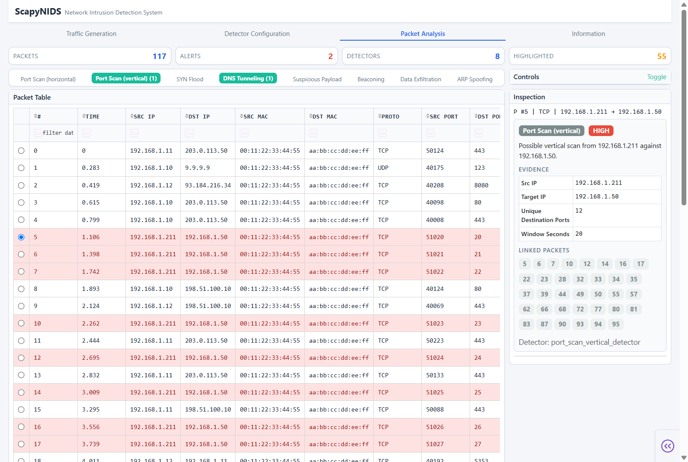

# ScapyNIDS: Network Intrusion Detection System

**ScapyNIDS** is a Scapy-powered network intrusion detection system with a Dash GUI. It generates synthetic PCAP files that combine benign traffic with realistic attack scenarios (e.g., port scans, SYN floods, DNS tunneling, beaconing, etc.). The user can select which detectors run and adjust their thresholds before each analysis. A backend service replays captures, extracts packet features, identifies attack patterns, and returns structured alerts. Results appear in an interactive packet table with highlighted rows and per-packet evidence. Everything runs locally from PCAP files; no live network capture required.

## Project Structure

- `backend/core/`: NIDS engine, shared models, packet feature extraction.
- `backend/detection/`: one detector module per attack class.
- `backend/traffic/`: synthetic traffic generators (benign + attack patterns).
- `backend/services/`: PCAP builder and analysis orchestration.
- `gui/`: Dash GUI; Traffic Generation, Detector Configuration, Packet Analysis, and Information tabs.
- `run_gui.py`: launch the Dash GUI (`python run_gui.py`).
- `data/`: output folder for PCAP files created by the GUI.


## Detectors


| Detector key           | Detects                                                       |
| ---------------------- | ------------------------------------------------------------- |
| `port_scan_horizontal` | One source scanning many destination IPs on the same port     |
| `port_scan_vertical`   | One source scanning many ports on the same destination IP     |
| `syn_flood`            | One source sending many SYN packets and a few ACK packets     |
| `dns_tunneling`        | A source encoding data in DNS queries                         |
| `suspicious_payload`   | Regex matches in plaintext payloads (cmd injection, traversal, etc.) |
| `beaconing`            | Regular periodic traffic to the same endpoint                 |
| `data_exfiltration`    | Large outbound byte bursts to external IPs                    |
| `arp_spoofing`         | One IP address claimed by multiple MAC addresses              |


## Setup

Tested on **Python 3.14**.

```powershell
python -m venv .venv
.venv\Scripts\activate
pip install -r requirements.txt

python run_gui.py
```

Open [http://127.0.0.1:8050/](http://127.0.0.1:8050/)

1. On **Traffic Generation**, configure benign and attack settings, then click **Generate PCAP**.
2. On **Packet Analysis**, select the PCAP, choose detectors, and click **Run Analysis**.



## Notes

The **Information** tab in the GUI documents every traffic, detector, and analysis setting.

See `notes.md` for developer scratch notes.