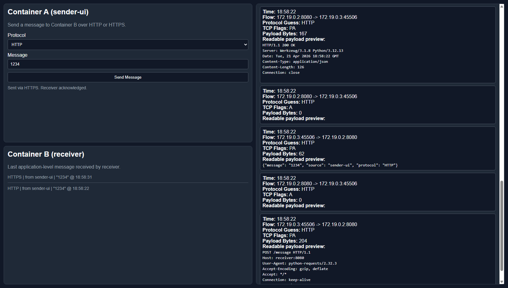
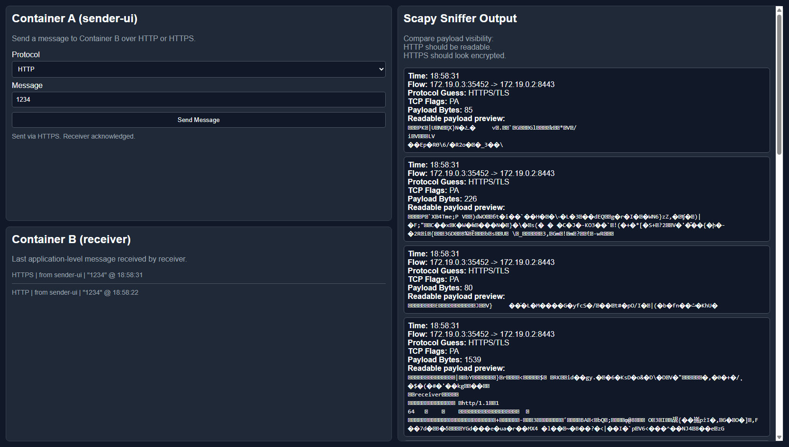

# PacketSniffer (simple HTTP vs HTTPS Demo)

This project demonstrates a basic cybersecurity networking concept of secure vs. insecure network connections:
- Two containers communicate over a Docker bridge network.
- The user can send messages over **HTTP** or **HTTPS**.
- A third container uses **Scapy** to capture (sniff) packets.
- The UI allows the user to compare how packet payloads appear in HTTP versus HTTPS traffic.

## System Overview

There are 3 services in `docker-compose.yml`:

1. `sender-ui` (Container A)
   - Sends messages to `receiver` using HTTP (`:8080`) or HTTPS (`:8443`).

2. `receiver` (Container B)
   - Receives messages on HTTP or HTTPS. 
   - Uses a self-signed TLS certificate (for demo only, to use HTTPS without buying real certificate).

3. `sniffer`
   - Runs Scapy to capture TCP packets on the Docker bridge interface.
   - Containers on a bridge network cannot see traffic between other containers, so the sniffer shares the receiver’s network environment to capture packets destined for the receiver.

## Observed HTTP packet flow during the demo (may vary slightly)
**HTTP**

- PA -> A : push (sender) and ack (receiver) request header
- PA -> A : push (sender) and ack (receiver) request body (actual payload)
- PA -> A : push (receiver) and ack (sender) response header
- PA -> A : push (receiver) and ack (sender) response body (acknowledgement of received data)
- F -> FA -> A : TCP 4-way connection termination initiated by sender

**HTTPS** — Unreadable payload in the sniffer (TLS encrypts application data). TCP flags are still readable.

## Usage

From project root:

```bash
docker compose up --build
```

Then open:
- `http://localhost:5000`



