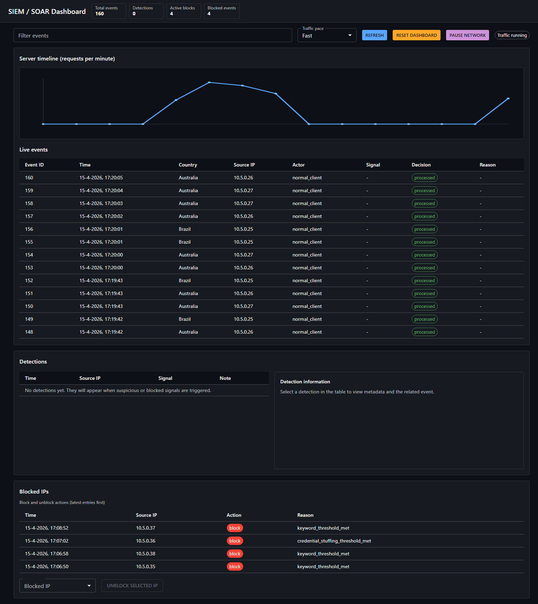
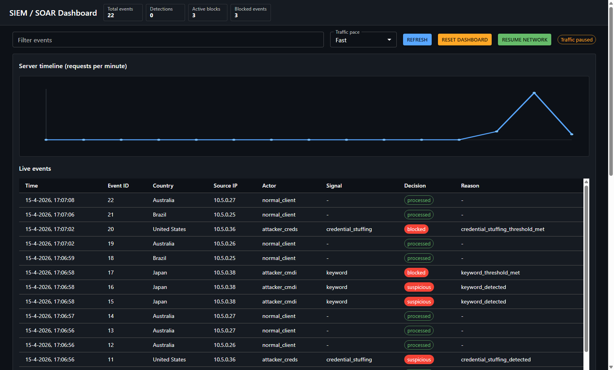

# SIEM/SOAR

SIEM/SOAR is a practical cybersecurity simulation that demonstrates how modern detection and response pipelines work from end to end. 
It generates both normal and malicious traffic, analyzes activity using rules, behavior checks and machine learning to detect threats, then automatically blocks them. The system runs as a multi-container Docker environment on an isolated bridge network, simulating realistic service communication and separated infrastructure behavior. A live React dashboard shows events, detections and response actions in near real time. 

## Components

- `main_server`: receives traffic on `/process`, enforces the blocklist, and forwards event data to the detector.
- `detector`: receives events on `/log`, runs rate/rule/ML detection logic (including credential-stuffing), maintains IP-specific risk scores, and requests block/unblock actions.
- `attacker-*`: multiple attacker profiles (SQL injection, credential stuffing, recon, command injection) with randomized behavior; attackers wait for model warmup and start in a staggered order.
- `client-server-*`: three normal traffic simulator services (`client-server`, `client-server-2`, `client-server-3`).
- `frontend`: React dashboard showing live events, detections, block actions, and a requests-per-minute timeline.
- `logs/siem.db`: shared SQLite store for events/detections/blocks.

## How It Works

1. Traffic (client/attackers) is sent to `main_server` at `/process`.
2. `main_server` logs request metadata via `main_server/logger.py`.
3. Logger posts event JSON to `detector` endpoint `/log`.
4. `detector` applies:
  - rate-limit checks,
  - credential-stuffing pattern checks,
  - keyword/rule checks,
  - IsolationForest anomaly detection (after baseline training),
  - risk threshold logic before blocking.
5. If threshold is met, `detector` calls `main_server` `/sync-blocklist`.
6. `main_server` updates the enforced blocklist and writes block/unblock records.
7. Dashboard reads detector APIs (`/api/events`, `/api/detections`, `/api/blocks`, `/api/metrics/summary`, `/api/model/status`) and live websocket stream.

## Setup

### 1) Look at the main repository README for instructions on how to download this specific project.

### 2) Build and start all services
Make sure you have Docker Desktop installed before running this project.

First time, run
```bash
docker compose up -d --build
```
After that, use
```bash
docker compose up -d
```
Optional: follow detector logs

```bash
docker compose logs -f detector
```

### 3) Open the UI

- Dashboard: [http://localhost:5173](http://localhost:5173)
- Detector API summary: [http://localhost:8001/api/metrics/summary](http://localhost:8001/api/metrics/summary)

### 4) Stop services

```bash
docker compose down
```




